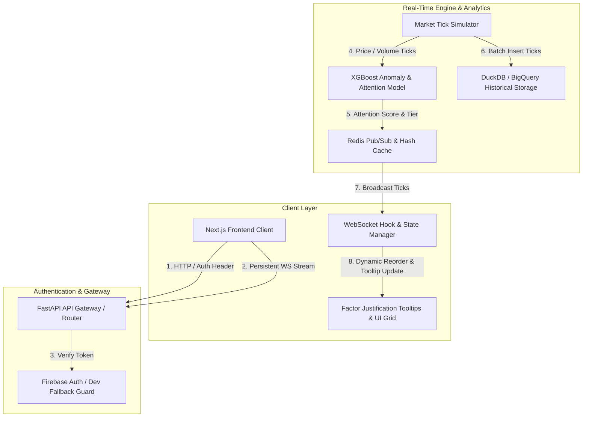

# Smart Market Watchlist

A high-throughput, event-driven market monitoring web application that tracks real-time asset prices, calculates quantitative attention scores using an XGBoost regression model, decomposes score factors, and generates session delta digests.

---

## System Architecture



---

## Features

- Real-Time Streaming: Sub-millisecond tick updates delivered via WebSockets with heartbeat connection monitoring and automatic reconnect handling.
- XGBoost Attention Engine: Quantitative regressor trained on volume Z-score, price velocity, volatility ratio, and level breakout flags to compute dynamic asset attention scores (0-100).
- Factor Justification Tooltips: Mathematical breakdown of score contributions (volume score, velocity score, volatility score, breakout bonus) visible on asset cards.
- Session Delta Digest: Historical baseline snapshotting that generates natural language summaries of market level breakouts and VWAP crosses since the user's last visit.
- Resilient Dual Storage & Fallback: Automatic in-memory Redis fallback if a live Redis cluster is unreachable, and DuckDB storage fallback if BigQuery credentials are omitted.

---

## Tech Stack

- Frontend: Next.js 16, React 19, TypeScript, Tailwind CSS, Framer Motion, Recharts
- Backend: FastAPI, Python 3.11/3.14, Uvicorn, Pydantic Settings
- Machine Learning: XGBoost, Scikit-Learn, NumPy, Pandas
- Database & Caching: Redis Pub/Sub, DuckDB, Google Cloud BigQuery
- Security & Auth: Firebase Admin SDK, PyJWT

---

## Project Structure

```
smart-market-watchlist/
├── backend/
│   ├── app/
│   │   ├── api/v1/          # REST & WebSocket API Routes
│   │   ├── core/            # Config, Redis, BigQuery, Firebase setup
│   │   ├── engine/          # Simulator, XGBoost Model, Anomaly Engine
│   │   └── main.py          # FastAPI Lifespan & Entrypoint
│   ├── requirements.txt
│   └── Dockerfile
├── frontend/
│   ├── app/                 # Next.js App Router Page & Layout
│   ├── components/          # Market Grid, Cards, Tooltips, Digest Banner
│   ├── hooks/               # WebSocket & State Management Hooks
│   ├── lib/                 # API Client, Firebase Auth, Types
│   └── package.json
└── README.md
```

---

## Local Development Instructions

### Prerequisites
- Node.js 18+ and npm
- Python 3.11+ and pip

### 1. Backend Setup
```bash
cd backend
python3 -m venv .venv
source .venv/bin/activate
pip install -r requirements.txt
python3 -m uvicorn app.main:app --host 0.0.0.0 --port 8000 --reload
```

The backend server will start on http://localhost:8000.
Health check endpoint: http://localhost:8000/health

### 2. Frontend Setup
```bash
cd frontend
npm install
npm run dev
```

The frontend application will start on http://localhost:3000.

---

## Environment Variables

### Frontend Environment Variables (`frontend/.env.local`)
```env
NEXT_PUBLIC_API_URL=<YOUR_BACKEND_API_URL>
NEXT_PUBLIC_WS_URL=<YOUR_BACKEND_WS_URL>
NEXT_PUBLIC_FIREBASE_API_KEY=<YOUR_FIREBASE_API_KEY>
NEXT_PUBLIC_FIREBASE_AUTH_DOMAIN=<YOUR_FIREBASE_AUTH_DOMAIN>
NEXT_PUBLIC_FIREBASE_PROJECT_ID=<YOUR_FIREBASE_PROJECT_ID>
NEXT_PUBLIC_FIREBASE_STORAGE_BUCKET=<YOUR_FIREBASE_STORAGE_BUCKET>
NEXT_PUBLIC_FIREBASE_MESSAGING_SENDER_ID=<YOUR_FIREBASE_MESSAGING_SENDER_ID>
NEXT_PUBLIC_FIREBASE_APP_ID=<YOUR_FIREBASE_APP_ID>
```

### Backend Environment Variables (`backend/.env`)
```env
PORT=8080
HOST=0.0.0.0
ENVIRONMENT=production
ALLOWED_ORIGINS=["*"]
USE_IN_MEMORY_REDIS_FALLBACK=true
USE_DUCKDB_FALLBACK=true
USE_DEV_AUTH_FALLBACK=true
FIREBASE_PROJECT_ID=<YOUR_FIREBASE_PROJECT_ID>
SECRET_KEY=<YOUR_SECRET_KEY>
```

---

## API Endpoints

- GET /health: Health check and fallback status.
- GET /api/v1/market/quotes: Latest asset market quotes and attention scores.
- GET /api/v1/market/history/{symbol}: Historical tick series for charting.
- POST /api/v1/market/simulate-anomaly: Trigger synthetic price jump for anomaly testing.
- GET /api/v1/watchlist: Fetch current watchlist symbols.
- POST /api/v1/watchlist: Add symbol to active watchlist.
- DELETE /api/v1/watchlist/{symbol}: Remove symbol from watchlist.
- POST /api/v1/watchlist/snapshot: Save baseline session snapshot.
- GET /api/v1/watchlist/digest: Generate session delta digest comparison.
- WS /ws/watchlist: WebSocket endpoint for live tick streaming.
